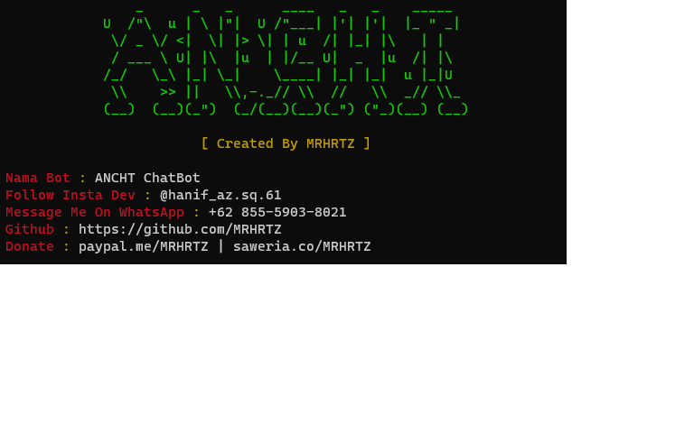

<h1>ANCHT BOT</h1>
  

## Installation
- Install node js ( <a href="https://nodejs.org/en/download/">Download Here</a> )
- clone this repo ( git clone https://github.com/MRHRTZ/Anon-Chat )
- Goto this directory ( cd Anon-Chat )
- Install It ( npm i )
- Run ( npm start )

## Note
- You can change sessions and owner at src/settings.json
- For different session you must change session name at settings 

## Contact Me
- <a href="https://wa.me/6285559038021">WhatsApp</a>
- <a href="https://www.instagram.com/hanif_az.sq.61">Instagram</a>